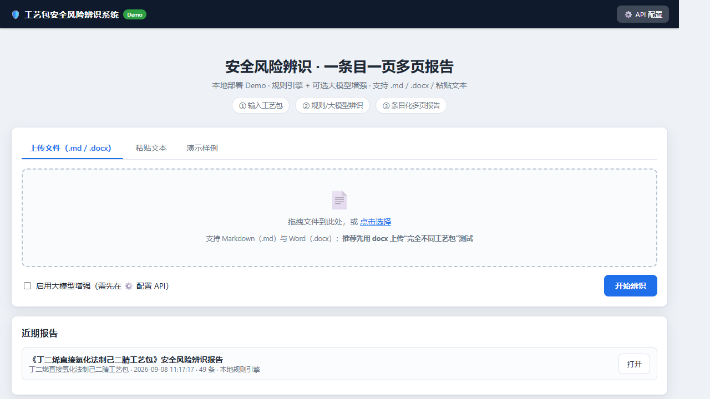
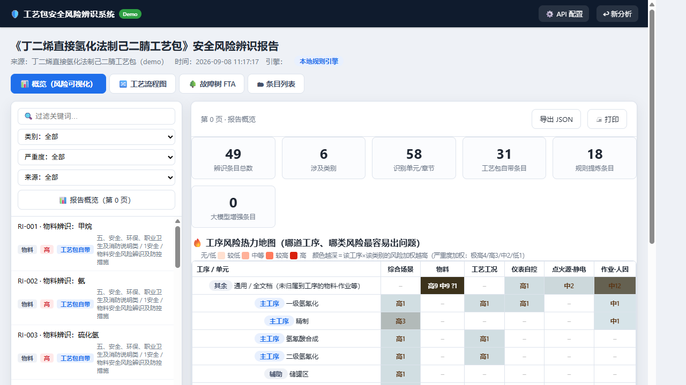
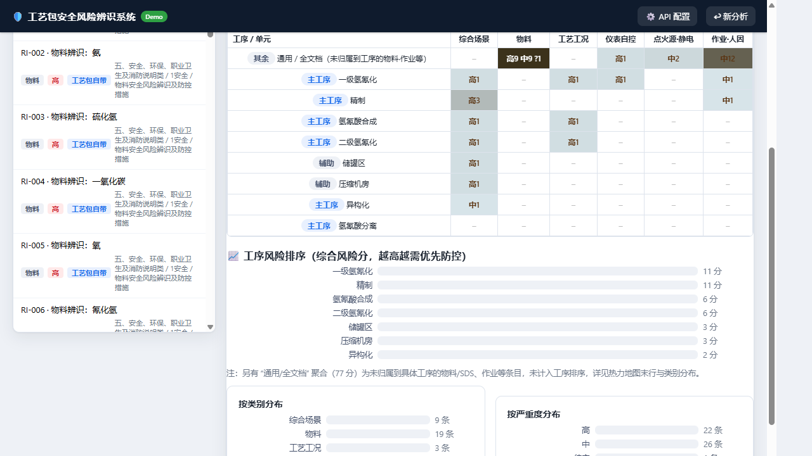
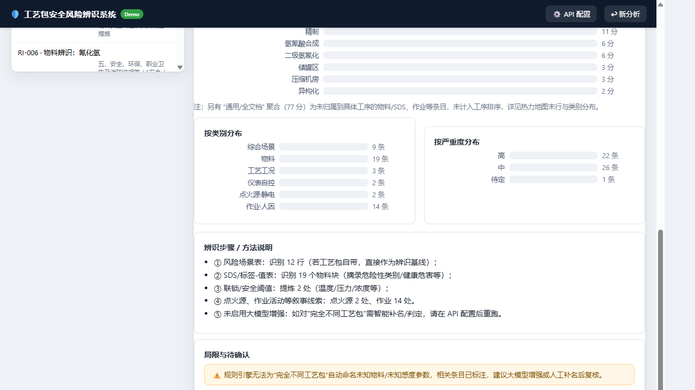
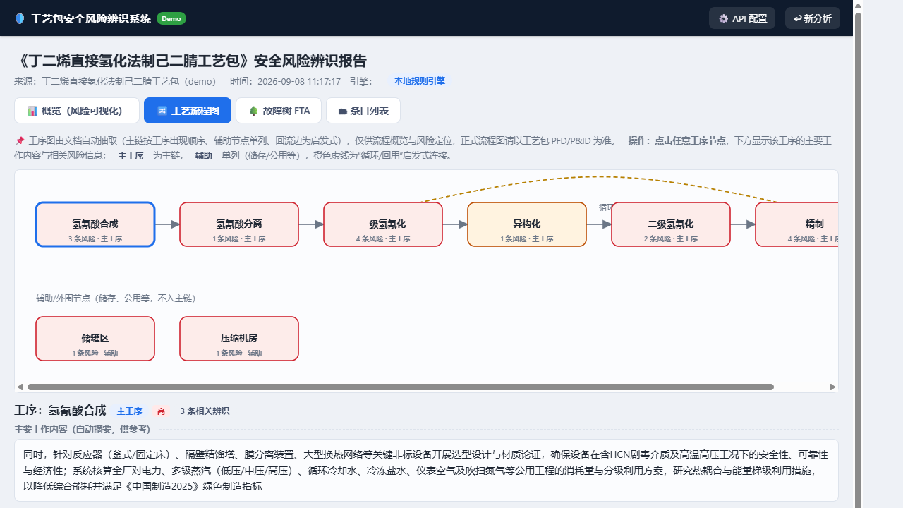
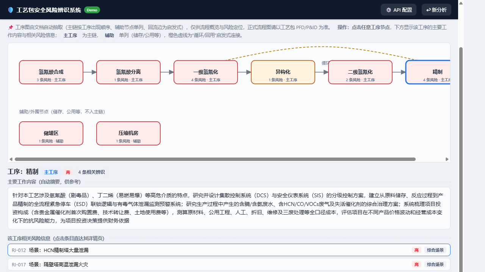
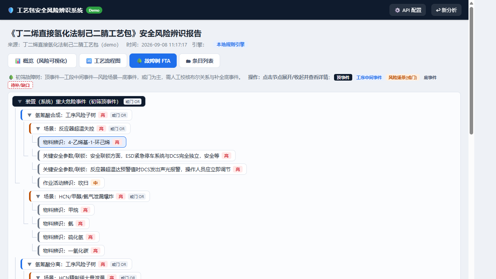
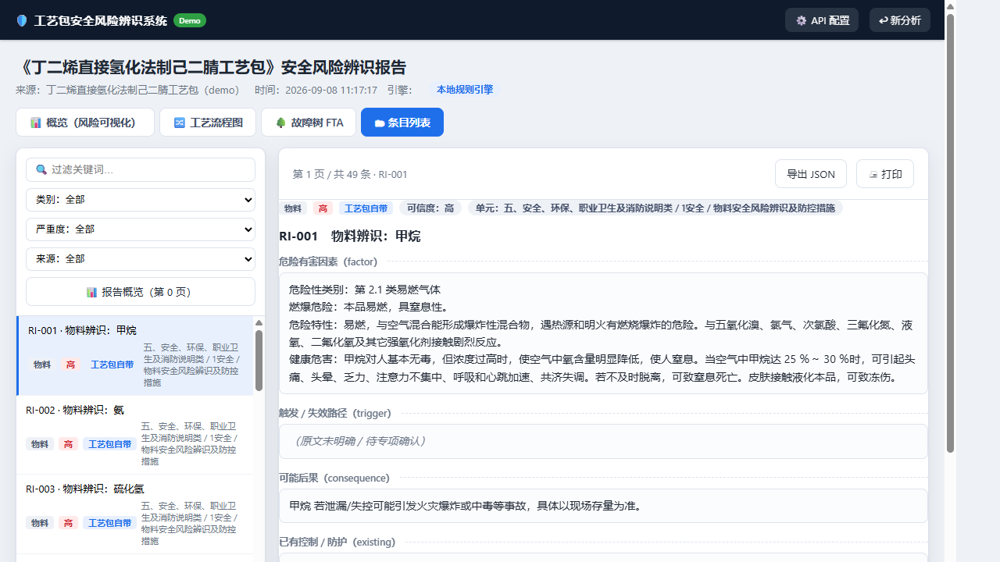
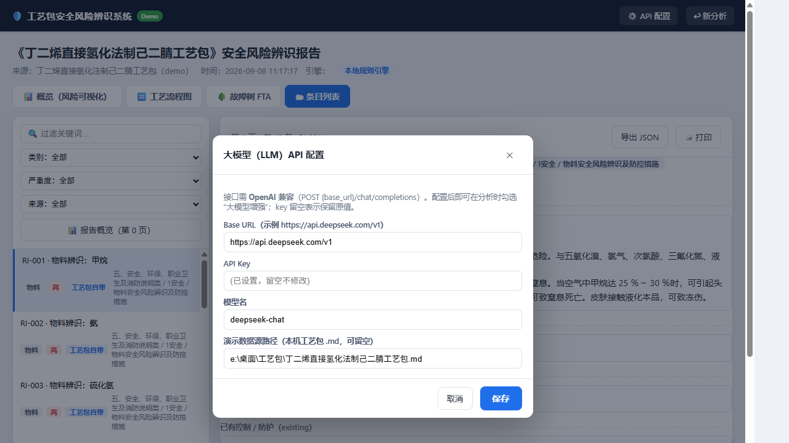

# 工艺包安全风险辨识系统 —— 使用说明

> 版本：Demo v0.2（本地部署，浏览器访问）
> 定位：把任意工艺包文档（.md / .docx / 粘贴文本）自动做**安全风险辨识**，并给出
> ① 图表化风险概览　② 可交互工序流程图　③ 数据驱动初筛故障树　④ 一条目一页的条目清单。
>
> 文档配图：本文内嵌各页面实机截图（图 1~图 9），帮助你逐页对照理解界面功能。

---

## 1. 快速开始

1. **启动服务**
   - 双击 `run.bat`；或命令行执行：
     `.venv\Scripts\python -m uvicorn app.main:app --host 127.0.0.1 --port 8000`
2. **打开页面**：浏览器访问 http://127.0.0.1:8000
3. **输入工艺包**（三选一）
   - 上传文件：支持 `.md` / `.txt` / `.docx`（Word 会先自动转成文本）；
   - 粘贴文本：直接粘正文（标题、表格、安全/物料/联锁章节均可）；
   - 演示样例：一键分析 `config.json` 中 `demo_package_path` 指向的工艺包
     （默认：本机《丁二烯直接氢化法制己二腈工艺包.md》）。
4. 可选：勾选 **大模型增强**（需先在右上角 ⚙️ 配置 API，见 §6）。
5. 点 **开始辨识 / 运行演示**，等待完成自动进入报告。

> 数据存于服务进程内存；重启后需重新分析（Demo 阶段未接数据库）。

---

## 2. 报告界面四个视图（顶部模式栏切换）

分析完成后通过顶栏在四个视图间切换：

### 2.1 概览（风险可视化）—— 默认
回答“**哪里风险最高、哪里相对较低**”，全部用颜色与图表表达：
- **统计卡片**：条目总数、类别数、单元数、来源构成（工艺包自带/规则/大模型）。
- **工序风险热力地图**：行＝工序/单元，列＝风险类别；
  单元格＝该类别的**高/中/低计数**，颜色深浅＝严重度加权风险
  （极高4 / 高3 / 中2 / 低1，越红风险越高）。
  → 一眼定位“哪道工序 × 哪类风险”最突出（如“一级氢氰化”这类高亮行）。
- **工序风险排序**：按工序综合风险分从高到低条形图（红色为最需优先防控），
  未归属到具体工序的物料/SDS/作业等聚合到“通用/全文档”，不计入工序排序。
- 类别分布、严重度分布、方法步骤说明、局限与待确认提示。

### 2.2 工艺流程图（交互式）
- 自动把工艺包“风险场景表的工序”按其出现顺序生成主链（己二腈示例：
  氢氰酸合成 → 氢氰酸分离 → 一级氢氰化 → 异构化 → 二级氢氰化 → 精制）；
  含“储存/公用”等**辅助节点**单列；检测到“循环/回用/返回”时追加**橙色虚线回流边**。
- **点击任意工序节点** → 下方显示该工序的：
  - **主要工作内容**（从原文自动摘要，标注“供参考”）；
  - **相关风险信息**（该工序关联的辨识条目列表，点条目直达其单页）。
- 节点颜色＝该工序风险等级（红/橙/绿/灰）。
- 注意：图为**自动抽取初稿**，正式流程图请以工艺包 PFD / P&ID 为准。

### 2.3 故障树 FTA（数据驱动初筛）
- 结构：**顶事件**（装置级重大事故）→ **工段中间事件** → **风险场景(或门)** → **底事件**
  （联锁/点火源/作业/物料聚合等致因）；另有“共性致因（跨工序）”子树。
- 逻辑门目前**简化为“或门”**、无频次/概率——仅用于梳理**工序间故障与风险相互影响**。
- 操作：**点击节点**展开/收起并查看详情（严重度、所属工序、关联条目，可直达条目页）；
  顶部图例区分 顶事件/中间事件/场景/底事件/待补缺口。
- **重要**：底事件-场景关联为规则启发式匹配，正式 FTA 需人工校核布尔关系、
  补全底事件与概率数据（见右侧“待补/缺口”节点）。

### 2.4 条目列表（一条目一页）
- 第 0 页概览＋逐条分页；每条目独立一页：
  危险有害因素 → 触发/失效路径 → 可能后果 → 已有控制 → 建议措施/待确认 →
  **来源出处** + **原文证据**。
- 侧栏支持：关键词过滤、按 类别 / 严重度 / 来源 筛选；左上角可随时回到概览。

---

## 3. 输出与导出
- 页面右上 **导出 JSON**：整份报告（含条目、流程、故障树）下载为 JSON，可二次处理；
- **打印**：打印当前页。

---

## 4. 辨识方法（引擎做了什么）
本地规则引擎按顺序执行：
1. 识别工艺包自带**风险场景表**，逐行成条（高可信，标记“工艺包自带”）；
2. 识别 **SDS / 标签-值表**，逐物料成条（自动命名，摘录危险性类别/健康危害等）；
3. 扫描 **联锁/安全阈值**（温度、压力、浓度 ppm/%LEL 等）与 **点火源**、**作业活动**；
4. 汇总为工序流程图、故障树与多页条目报告；每个条目都带原文出处与证据，可追溯。

---

## 5. 用一份“完全不同”的工艺包测试
1. 把新工艺包存成 `.md` 或 `.docx`（内容含 工段/工序 章节、安全/风险/物料/联锁等章节最佳）；
2. 上传 → 开始辨识；
3. 检查四类产出并对照判断：
   - 物料条目是否被**自动命名**（SDS 键值表可命名的都会命名）；
   - 风险场景表是否**逐行拆出**、流程主链是否与你的工艺流程一致；
   - 联锁/作业/点火源条目是否覆盖主要危险环节；
   - 若条目明显偏少或物料名缺失 → 配置 LLM 后勾选“大模型增强”重跑对比覆盖率。
4. 流程/故障树若与真实工艺有出入（如缺回流、缺工序），属自动抽取局限，
   可结合其“来源/证据”人工修订；正式结论请以专项分析为准。

---

## 6. 接入大模型 API（可选，OpenAI 兼容）
右上角 **⚙️ API 配置** 填三项后保存（也可直接改 `config.json`）：
| 项 | 说明 | 示例 |
| --- | --- | --- |
| Base URL | 兼容 OpenAI 的地址（软件请求 `{base_url}/chat/completions`） | `https://api.deepseek.com/v1` |
| API Key | 密钥（读取界面时打码；留空＝不修改原 key） | `sk-…` |
| 模型名 | | `deepseek-chat` |

分析时勾选“大模型增强”即生效；key 未配置/调用失败会自动**回退本地规则引擎**
并在报告“局限与待确认”中提示。

---

## 7. 软件自身 REST 接口
| 接口 | 说明 |
| --- | --- |
| `GET /api/health` | 健康检查 |
| `GET /api/config` / `POST /api/config` | 读/写配置 |
| `POST /api/analyze/text` | `{text, filename?, use_llm?}` 分析文本 |
| `POST /api/analyze/upload` | multipart：`file`（.md/.docx/.txt）、`use_llm` |
| `GET /api/analyze/demo` | 分析演示样例 |
| `GET /api/reports` | 报告列表 |
| `GET /api/report/{id}` | 整份报告 JSON（含 `items/flow/fault_tree`） |
| `GET /api/report/{id}/items?page=&size=` | 条目分页 |
| `DELETE /api/report/{id}` | 删除报告 |
| `GET /api/export/{id}` | 导出 JSON |

---

## 8. 已知边界与合规提示
- 规则引擎可自动命名常见化工物料（来自 SDS），但对**纯叙述、完全陌生工艺包**的
  未知物料名/感度等参数需大模型或人工补名（报告会给出“待确认”提示）。
- 流程图、故障树均为**数据驱动的初筛**：流程主链按出现顺序、回流边为启发式；
  故障树逻辑门简化为“或”、无概率——都不能替代正式 PFD/P&ID 与 FTA/HAZOP/LOPA/QRA。
- 军品（火炸药/装药等）的感度/殉爆/量-距离等为预留“军品专项”维度，需另行叠加专项辨识。
- 涉及涉密/军品数据时请先完成保密审查与脱敏。
- 本软件 Demo 仅供辨识与测试，正式安全评价请以专项分析与现行标准为准。

---

## 9. 常见问题
- **改了代码页面没变化？** 浏览器缓存静态资源，请 **Ctrl+F5 强制刷新**。
- **大模型增强没生效？** 看报告“局限与待确认”，或 API 配置里的 key/base_url 是否正确、
  服务是否可达（请求 `{base_url}/chat/completions`）。
- **某工序没有关联条目？** 说明该工序名称未出现在风险条目/描述中；可启用 LLM 增强，
  或在工艺流程图中查看“辅助节点/通用”分组。
