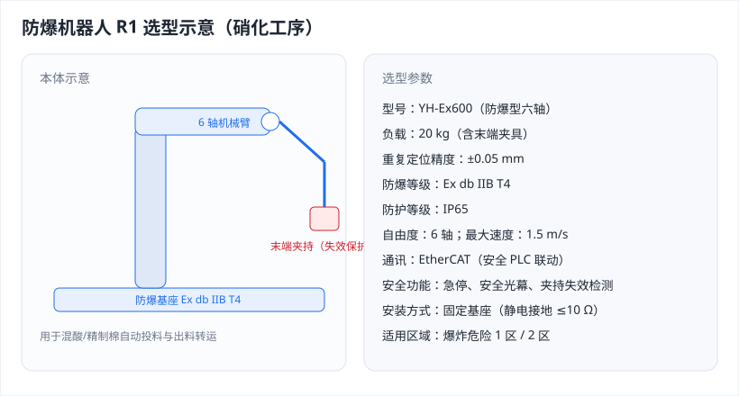
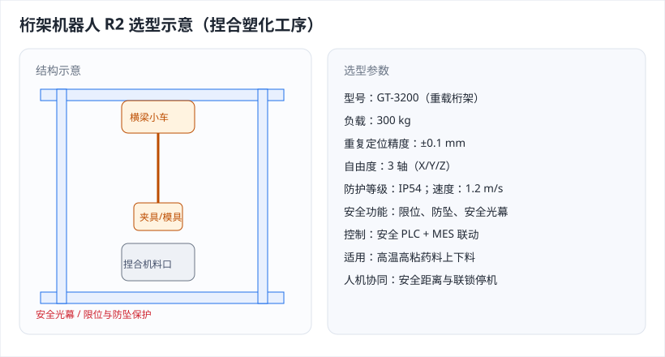
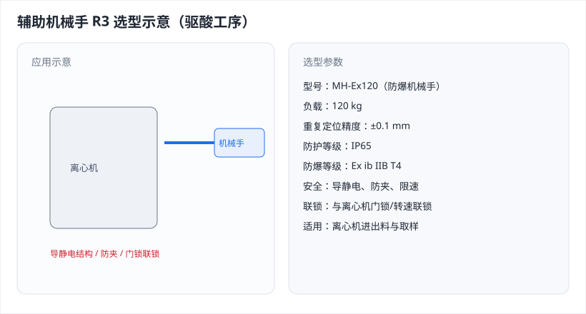
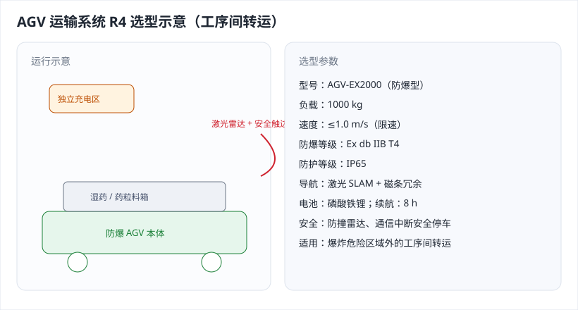
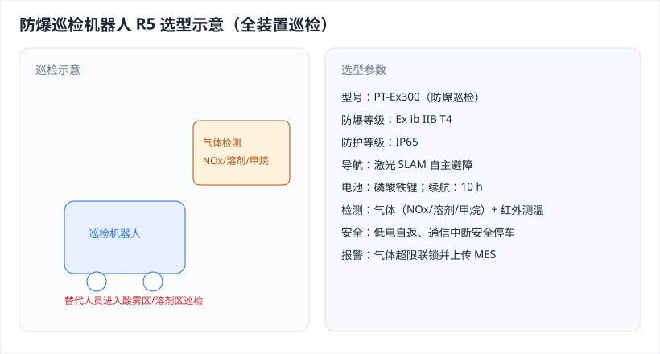

# 硝化棉单基发射药自动化生产线工艺包（演示示例 · 脱敏/虚构）

> 本文件为**演示用示例工艺包**，用于测试《工艺包安全风险辨识系统》的全部功能，特别是**自动化装备（机器人/机械手/AGV）**的风险辨识。
> 内容为行业通用技术常识的**脱敏虚构**，非任何单位的真实工艺数据；涉及军品须按保密规定另行管理。

---

## 一、基础信息

### 1. 项目概述

本工艺包以精制棉为原料，经混酸硝化制得硝化棉，再经驱酸、煮洗、漂洗、醇醚置换、捏合塑化、压伸成型、驱溶剂烘干、混同包装等工序生产**单基发射药**。产线实施**自动化改造**：以**防爆机器人、桁架机器人、辅助机械手、AGV 运输系统、防爆巡检机器人**替代高风险区人工操作，**显著减少操作人数、降低人员暴露于易燃易爆与剧毒/强腐蚀环境的风险**。

### 2. 主要技术指标

- 生产能力：单基发射药 5000 t/a；年操作时间 6000 h。
- 硝化温度 25~35 ℃；捏合塑化 45~65 ℃；压伸成型 40~60 ℃、6~12 MPa；烘干 45~60 ℃。
- 自动化率：危险工房关键操作自动化率 ≥85%；涉药工房在线定员较改造前下降约 60%。
- 主要原料：精制棉、硝酸、硫酸、乙醇、乙醚、二苯胺（安定剂）。

### 3. 自动化系统构成

- **防爆机器人**：用于硝化工序混酸/精制棉的自动投料与出料转运，本体防爆等级 Ex db IIB T4。
- **桁架机器人**：用于捏合塑化工序的上下料与模具搬运，配安全光幕与限位保护。
- **辅助机械手**：用于驱酸工序离心机进出料与取样，导静电设计。
- **AGV 运输系统**：用于工序间湿药/药粒/空桶转运，激光雷达防撞、限速、专用充电区。
- **防爆巡检机器人**：用于酸雾/溶剂区气体检测与巡检，替代人员进入高毒易爆区域。
- 控制系统：DCS + 安全 PLC（急停、安全光幕、通信中断安全停车），上位 MES 统一定员与作业许可管理。

---

## 二、物料安全风险辨识及防控措施

### 1. 硝酸

| 化学品中文名称 | 硝酸 |
| CAS No. | 7697-37-2 |
| 危险性类别 | 第 8.1 类酸性腐蚀品；氧化剂 |
| 健康危害 | 强腐蚀性，吸入酸雾刺激呼吸道可致化学性肺炎，皮肤接触严重灼伤。 |
| 燃爆危险 | 强氧化剂，与还原剂、有机物接触可剧烈反应引起燃烧爆炸。 |
| 操作注意事项 | 密闭投料、局部排风；自动化投料减少人接触，设碱吸收。 |
| 储存注意事项 | 与还原剂、碱类、易燃物分开；阴凉通风、防泄漏围堰。 |

### 2. 乙醚

| 化学品中文名称 | 乙醚 |
| CAS No. | 60-29-7 |
| 危险性类别 | 第 3.1 类低闪点易燃液体 |
| 健康危害 | 麻醉作用，吸入高浓度致头晕昏迷。 |
| 燃爆危险 | 极易燃，闪点约 -45 ℃，爆炸极限 1.7%~36%（V/V）。 |
| 危险特性 | 蒸气积聚遇明火、高热、静电火花即燃爆；久存可生成过氧化物。 |
| 操作注意事项 | 全密闭、氮封、防爆电气；AGV/机械手转运须导静电接地。 |
| 储存注意事项 | 阴凉避光、库温≤30 ℃，氮封、远离火种热源与氧化剂。 |

### 3. 硝化棉（含氮量≥12.5%）

| 化学品中文名称 | 硝化棉 |
| 危险性类别 | 易燃固体（兼有爆炸性） |
| 健康危害 | 粉尘刺激呼吸道与皮肤，长期接触可致头痛、皮炎。 |
| 燃爆危险 | 极易燃，遇明火、高热、摩擦、撞击或静电放电均可引起燃烧爆炸。 |
| 危险特性 | 干燥状态极易自燃；机器人夹持失效导致的跌落、碰撞、摩擦是重要诱发因素。 |
| 操作注意事项 | 全程保持含水；机器人末端夹持失效保护；防静电、防摩擦撞击；控制在线药量。 |
| 储存注意事项 | 湿态储存于防爆防雷库房，与酸、氧化剂、火源隔离，定期检测安定性。 |

### 4. 二苯胺（安定剂）

| 化学品中文名称 | 二苯胺 |
| CAS No. | 122-39-4 |
| 危险性类别 | 第 6.1 类毒害品；可燃 |
| 健康危害 | 有毒，可经吸入/食入/皮肤吸收，对血液系统有影响。 |
| 燃爆危险 | 可燃，粉尘与空气可形成爆炸性混合物。 |
| 操作注意事项 | 密闭自动投料、控制粉尘、个体防护。 |
| 储存注意事项 | 阴凉干燥、远离火种热源，防粉尘扬散。 |

---

## 三、自动化装备台账（机器人清单）

| 编号 | 机器人名称 | 类型 | 负责工序 | 工序内容 | 原操作人数 | 现操作人数 | 该工序主要风险 | 机器人可能新增风险 | 避免/降低的风险 | 防爆与安全要求 |
| --- | --- | --- | --- | --- | --- | --- | --- | --- | --- | --- |
| RB1 | 防爆机器人 R1 | 防爆机器人 | 硝化工序 | 自动称量并投加精制棉与混酸、出料转运 | 4 | 1 | 混酸灼伤、硝化超温失控、易燃易爆 | 失控与动作异常、末端夹持失效致物料跌落与碰撞摩擦、局部温升过热、通信中断、静电放电 | 人员近距离接触强腐蚀混酸与硝化棉导致灼伤、中毒与人为失误引发的燃爆 | Ex db IIB T4、IP65、急停、接地跨接、末端夹持失效保护 |
| RB2 | 桁架机器人 R2 | 桁架机器人 | 捏合塑化工序 | 捏合机上下料、模具搬运与定位 | 3 | 1 | 高温物料灼烫、捏合超温致物料分解燃爆 | 定位偏差、卡滞、过载发热、掉落撞击、限位失效 | 人员进入捏合区接触高温高粘药料与粉尘 | 防爆、限位与防坠、安全光幕、人机协同安全距离 |
| RB3 | 辅助机械手 R3 | 辅助机械手 | 驱酸工序 | 离心机进出料与取样、滤饼转运 | 3 | 1 | 离心摩擦与静电积聚引燃硝化棉、含酸物料飞溅 | 夹持失效致湿药掉落、撞击、静电放电、轨迹偏移 | 人工开盖接触含酸硝化棉与清洗残酸 | 防爆、导静电接地、防夹伤、限速 |
| RB4 | AGV 运输系统 R4 | AGV | 工序间转运 | 湿药/药粒/空桶在硝化—驱酸—煮洗—置换—烘干—包装间转运 | 6 | 2 | 转运途中泄漏、静电、碰撞与倾覆 | 碰撞与碾压、超速、倾覆、充电区燃爆、通信中断、电池热失控 | 人工搬运重物、穿越危险区与交叉作业造成的伤害与泄漏 | 防爆型AGV、激光雷达防撞、限速、专用充电区、通信中断安全停车 |
| RB5 | 防爆巡检机器人 R5 | 巡检机器人 | 全装置巡检 | 酸雾/溶剂区气体检测与自主巡检 | 4 | 1 | 人员巡检中毒、缺氧与爆炸区域暴露 | 电池温升、通信中断、避障失效、本体防爆失效 | 人员进入高毒/易爆区域巡检导致中毒与爆炸伤害 | Ex ib IIB T4、自主避障、气体检测联锁、低电自返 |

---

## 四、工艺流程简述（含自动化）

- 储罐区：储存硝酸、硫酸、乙醇、乙醚，乙醚罐氮封、喷淋降温、静电接地与防火堤。
- 硝化工序：防爆机器人 R1 自动称量并投加精制棉与混酸，控制硝化温度 25~35 ℃，反应放热由夹套冷却水带走，出料为含酸硝化棉。
- 驱酸工序：辅助机械手 R3 完成离心机进出料与取样，驱除游离酸，回收稀酸送酸回收。
- 煮洗工序：95~100 ℃、0.3~0.5 MPa 蒸汽多级逆流煮洗，去除残酸提高安定性，煮洗水 pH 在线检测，稀酸回收后返回硝化工序循环使用。
- 漂洗工序：常压 20~40 ℃ 漂洗至中性，细粉沉降过滤收集。
- 醇醚置换工序：乙醇与乙醚（体积比约 1:2）置换水分，温度 ≤35 ℃。
- 捏合塑化工序：桁架机器人 R2 上下料与模具搬运，捏合机 45~65 ℃ 加入二苯胺安定剂塑化均匀。
- 压伸成型工序：塑化药料经螺杆挤压成型造粒，温度 40~60 ℃、压力 6~12 MPa。
- 驱溶剂烘干工序：45~60 ℃ 热风驱除溶剂，在线监测溶剂蒸气浓度，烘干后挥发分 ≤1.0%。
- 混同包装工序：药粒混同检验后防静电包装。
- 工序间转运：AGV 运输系统 R4 沿固定路径转运湿药、药粒与空桶，充电区独立设置。
- 全装置巡检：防爆巡检机器人 R5 对酸雾区、溶剂区与关键设备自主巡检。
- 溶剂回收工段：乙醇乙醚精馏回收，真空操作、塔顶温度 ≤80 ℃，定期检测过氧化物。
- 污水处理站：含酸与硝化棉细粉废水经中和、沉降处理。
- 酸雾吸收塔：硝化、煮洗酸雾经碱液吸收，在线监测氮氧化物。

---

## 五、工艺安全风险辨识及防控措施

| 序号 | 工序 | 风险场景 | 风险等级 | 主要点火源 | 关键管控措施 |
| --- | --- | --- | --- | --- | --- |
| 1 | 硝化工序 | 防爆机器人 R1 投料失控、末端夹持失效致硝化棉跌落碰撞 | 高风险 | 摩擦、撞击 | 机器人急停与安全光幕、夹持失效保护、限速与跌落防护 |
| 2 | 硝化工序 | 硝化反应超温、局部过热 | 高风险 | 热表面、摩擦 | DCS+SIS 温度联锁、紧急加大冷却水、切断加料 |
| 3 | 驱酸工序 | 辅助机械手 R3 离心机进出料夹持失效、湿药掉落 | 高风险 | 摩擦、静电 | 导静电接地、夹持检测、限速与防夹 |
| 4 | 煮洗工序 | 蒸汽超压、高温物料灼烫 | 中风险 | 热表面 | 安全阀、隔热保温、压力联锁 |
| 5 | 漂洗工序 | 硝化棉细粉进入废水积聚燃烧 | 中风险 | 静电、摩擦 | 细粉沉降过滤、废水封闭输送、定期清理 |
| 6 | 醇醚置换工序 | 乙醚蒸气泄漏形成爆炸性混合物 | 高风险 | 电气火花、静电、明火 | 防爆电气、LEL 检测、氮封、接地跨接 |
| 6 | 捏合塑化工序 | 桁架机器人 R2 定位偏差、卡滞致物料掉落 | 高风险 | 摩擦、热表面 | 限位与防坠、安全光幕、过载保护 |
| 7 | 捏合塑化工序 | 捏合超温致物料热分解燃爆 | 高风险 | 热表面、摩擦 | 超温联锁停搅拌、加溶剂降温 |
| 8 | 压伸成型工序 | 螺杆挤压摩擦、局部过热 | 高风险 | 摩擦、热表面 | 温度联锁、断料保护、限压保护 |
| 9 | 驱溶剂烘干工序 | 烘干超温、溶剂蒸气积聚 | 高风险 | 热表面、静电 | 温度联锁、溶剂浓度联锁、防爆通风 |
| 10 | 混同包装工序 | AGV R4 转运碰撞、倾覆、静电放电 | 高风险 | 静电、撞击 | 激光雷达防撞、限速、导静电、安全隔离通道 |
| 11 | 储罐区 | AGV 充电区燃爆、储罐泄漏火灾爆炸 | 高风险 | 雷电、静电、明火 | 独立充电区、氮封、喷淋、接地、防火堤 |
| 12 | 溶剂回收工段 | 乙醚精馏塔超压、过氧化物分解爆炸 | 高风险 | 热表面、静电 | 安全阀、过氧化物检测、真空与温度联锁 |
| 13 | 污水处理站 | 含硝化棉细粉废水积聚燃烧 | 中风险 | 静电、摩擦 | 封闭收集、定期清理、禁火管理 |
| 14 | 酸雾吸收塔 | 吸收失效致酸雾、氮氧化物逸散 | 中风险 | 电气火花 | 备用碱液、NOx 在线监测联锁 |
| 15 | 消防水系统 | 消防水/泡沫不足致事故扩大 | 中风险 | — | 定期测试、消防联动、储水量保障 |

---

## 六、安全联锁与在线监测

- 硝化温度 25~35 ℃；温度高联锁 ≥45 ℃ 切断精制棉与混酸进料并紧急加大冷却水；机器人投料与联锁联动，联锁动作时机器人安全停机。
- 捏合温度 45~65 ℃；温度高联锁 ≥75 ℃ 停捏合机搅拌、切断夹套蒸汽并加溶剂降温。
- 烘干温度 45~60 ℃；温度高联锁 ≥90 ℃ 切断蒸汽并加大排风；溶剂蒸气浓度 ≥25%LEL 报警、≥50%LEL 联锁停机通风。
- 压伸成型压力 6~12 MPa；压力高联锁 ≥15 MPa 停机泄压；螺杆温度高联锁 ≥70 ℃ 切断加热。
- 机器人安全：急停回路与安全 PLC 独立于 DCS，动作响应 ≤0.5 s；安全光幕/安全门被触发联锁停机。
- AGV 安全：行驶限速 ≤1.0 m/s，激光雷达防撞，通信中断自动安全停车；充电区独立且在爆炸危险区域外。
- 通信与供电：机器人与机械手的控制通信中断时自动进入安全停车位，失电保持夹持不得掉落。
- 有毒气体（NOx）探测器报警值一级 5 ppm、二级 10 ppm；可燃气体探测器 20%LEL / 50%LEL。
- 开车前氮气置换至氧含量 ≤2% 后引料；停车按“停进料—机器人退出—降压—置换—清理”顺序执行 ESD。

---

## 七、静电、防爆与作业安全

- 涉药工房与溶剂工段按爆炸危险区域选用防爆电气；金属设备、管道、容器与机器人本体可靠接地，静电接地电阻不大于 10 Ω。
- 机器人、机械手与 AGV 进入爆炸危险区域必须满足防爆等级（如 Ex db IIB T4、Ex ib IIB T4），并定期检测防爆性能。
- 硝化棉对摩擦、撞击和静电敏感，机器人末端夹持失效、跌落或碰撞摩擦均可能引发燃烧甚至爆炸，必须设置夹持失效保护与控制在线药量。
- 机器人高速动作、轨迹偏移或限位失效可能造成碰撞、挤压与人员伤害，须设置安全光幕、急停、限速与人机协同安全距离。
- AGV 可能发生碰撞、超速、倾覆与充电区燃爆，应设置防撞雷达、限速、路径隔离与专用充电区，并防止通信中断。
- 危险工房按定员定量与安全距离控制在线药量，设置抗爆间与泄爆面，防止殉爆传播与冲击波伤害。
- 对硝化棉开展撞击感度、摩擦感度和静电感度检验，并用 DSC 热分析评估自加速分解温度。
- 开车、停车严格执行操作规程：开车前吹扫置换并分析合格，停车后机器人退出并清理残药、消除积粉。
- 检维修前应停机、断电挂牌、清理残药并办理作业许可；进入受限空间前须置换分析合格并设专人监护。
- 动火作业须先办理动火许可并对可燃气体与药粉检测合格；机器人示教与调试须在停机并清理残药后进行。
- 自动化改造后危险性工序在线定员由 20 人降至 6 人，减少操作人数约 14 人，人员主要暴露环节由现场操作转为远程监控。

---

## 八、三废处理与消防

- 含酸废水经中和沉淀后回用或达标排放；硝化棉细粉经沉淀过滤密闭收集，不得排入下水道。
- 溶剂废气与酸雾分别经吸附、碱吸收处理达标排放；溶剂回收系统循环利用。
- 装置区设火灾自动报警与消防联动，配泡沫、喷淋及消防水系统，机器人作业区预留消防通道与隔离带。

---

## 九、参考文件与设计依据

- GB 50058 爆炸危险环境电力装置设计规范
- GB 3836.1 爆炸性环境 第 1 部分：设备 通用要求
- GB 3836.2 爆炸性环境 第 2 部分：由隔爆外壳“d”保护的设备
- GB/T 50770 石油化工安全仪表系统设计规范
- GB 50160 石油化工企业设计防火标准
- GB 18218 危险化学品重大危险源辨识
- GB 12158 防止静电事故通用导则
- GB/T 15706 机械安全 设计通则 风险评估与风险减小
- GB 11291.1 工业环境用机器人 安全要求 第 1 部分：机器人
- GB/T 36008 协作机器人 安全要求
- GB/T 16855.1 机械安全 控制系统安全相关部件 第 1 部分：设计通则
- GB/T 20867 工业机器人 安全实施规范
- 《危险化学品安全技术全书》
- 《化工工艺设计手册》
- 《化工过程安全管理导则》
- 《防火防爆安全技术》
- 《爆炸危险环境电气设计手册》
- 《工业机器人应用与选型手册》
- 企业内部《自动化装备（机器人/AGV）安全管理办法》
- 企业内部《涉药工房定员定量管理规定》

## 十、自动化装备选型

### 1. 防爆机器人 R1 选型

型号：YH-Ex600（防爆型六轴）；负载：20 kg（含末端夹具）；重复定位精度：±0.05 mm；防爆等级：Ex db IIB T4；防护等级：IP65；自由度：6 轴；最大速度：1.5 m/s；通讯：EtherCAT。
选型说明：按爆炸危险 1 区选型，本体与电控柜均为隔爆结构，末端配置夹持失效检测与跌落防护；与安全 PLC 联动实现急停与安全光幕停机。

### 2. 桁架机器人 R2 选型

型号：GT-3200（重载桁架）；负载：300 kg；重复定位精度：±0.1 mm；自由度：3 轴（X/Y/Z）；防护等级：IP54；速度：1.2 m/s。
选型说明：针对高温高粘药料上下料选型，配置限位、防坠与安全光幕，与人机协同安全距离联锁；控制系统接入安全 PLC 与 MES。

### 3. 辅助机械手 R3 选型

型号：MH-Ex120；负载：120 kg；重复定位精度：±0.1 mm；防护等级：IP65；防爆等级：Ex ib IIB T4。
选型说明：用于离心机进出料与取样，采用导静电结构与防夹设计，动作限速并与离心机门锁联锁。

### 4. AGV 运输系统 R4 选型

型号：AGV-EX2000（防爆型）；负载：1000 kg；速度：≤1.0 m/s（限速）；防爆等级：Ex db IIB T4；防护等级：IP65；导航：激光 SLAM + 磁条冗余；电池：磷酸铁锂；续航：8 h。
选型说明：按工序间转运需求选型，配置激光雷达防撞、安全触边与通信中断安全停车；充电区独立设置于爆炸危险区域外。

### 5. 防爆巡检机器人 R5 选型

型号：PT-Ex300；防爆等级：Ex ib IIB T4；防护等级：IP65；导航：激光 SLAM；电池：磷酸铁锂；续航：10 h；搭载甲烷/溶剂/NOx 气体检测模块与红外测温。
选型说明：替代人员进入酸雾区、溶剂区巡检，具备自主避障、低电自返与气体检测联锁报警功能。

